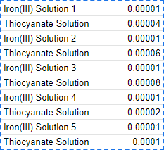

# Keyword Grouper
**About:** This program takes in a list of items and corresponding values from a spreadsheet as redirected user input and a list of arguments as keywords to search for in the data. It then groups any items that match the keyword(s) into an equal number of categories.

**Motivation for this project:** I made this years ago to brush up on the Standard Template Library and learn Markdown, mainly during the early days of the panorama

Similarly to CSV files, it helped to visualize data better within a spreadsheet or Jupyter Notebook.

## Usage:
```
./group keyword category < input_data.txt > output_data.txt
```

### General Form

```
./group keyword1 category1 ... keyword#n category#n < input.txt > output.txt
```

### Toy Example

Consider the case of condensing a list of peppers to (counterintuitively) be more generic. Any entries in `peppers.txt` containing the keyword `chili` are grouped to be a new category called `Chili Peppers:`, and any entries/peppers containing the keyword `peppers` are condensed to a new category simply called `Peppers:`.

#### peppers.txt

```
banana pepper 12
bell pepper 3
bird's eye chili 4
Cheongyang chili 4
```

This can be accomplished with one line/iteration of the program to group both `chili` and `pepper` at the same time, or with multiple iterations to view output throughout the process. 

```
./group chili "Chili Peppers:" pepper Peppers: < peppers.txt > peppers_grouped.txt
```

#### peppers_grouped.txt

```
Peppers: 15
Chili Peppers: 8

Output for copying into spreadsheets:

Peppers:
Chili Peppers:
15
8
```

Note: Neither the keyword nor category are case-sensitive, so the program should still group through
different capitalization changes or typos. Additionally, if an entry contains multiple keywords from the 
command line arguments, then the keyword that was entered first would match the entry to the new category.
Ex: "Chili Pepper _" would be grouped into the "Peppers" category if the command line argument 
began with "pepper" as the first keyword, rather than "chili".

## Example:

I used an old assignment from a chemistry class. This is where both Markdown and equilibrium constant reactions stopped being fun.

| Solution | Fe<sup>3+</sup> Initial | SCN<sup>-</sup> Initial | FeSCN<sup>2+</sup> Produced | Fe<sup>3+</sup> Remaining | SCN<sup>-</sup> Remaining |
| :------: | :---------------------: | :---------------------: | :-------------------------: | :-----------------------: | :-----------------------: |
|    1     |   1 x 10<sup>-5</sup>   |         0.00002         |   3.40 x 10<sup>-7</sup>    |  9.60 x 10<sup>-6</sup>   |  1.97 x 10<sup>-6</sup>   |
|    2     |  1 x 10^<sup>-5</sup>   |         0.00004         |   8.80 x 10<sup>-7</sup>    |  9.12 x 10<sup>-6</sup>   |  3.91 x 10<sup>-6</sup>   |
|    3     |   1 x 10<sup>-5</sup>   |         0.00006         |   1.17 x 10<sup>-6</sup>    |  8.83 x 10<sup>-6</sup>   |  5.88 x 10<sup>-6</sup>   |
|    4     |   1 x 10<sup>-5</sup>   |         0.00008         |   1.64 x 10<sup>-6</sup>    |  8.36 x 10<sup>-6</sup>   |  7.84 x 10<sup>-6</sup>   |
|    5     |   1 x 10<sup>-5</sup>   |         0.0001          |   2.07 x 10<sup>-6</sup>    |  7.93 x 10<sup>-6</sup>   |  9.79 x 10<sup>-5</sup>   |



```
./group "Iron(III)" "Iron(III):" Thiocyanate "Thiocyanate:" < Reactants.txt > Remaining.txt
```

### Reactants.txt

```
Iron(III) Solution 1	0.00001
Thiocyanate Solution 1	0.00004
Iron(III) Solution 2	0.00001
Thiocyanate Solution 2	0.00006
Iron(III) Solution 3	0.00001
Thiocyanate Solution 1	0.00008
Iron(III) Solution 4	0.00001
Thiocyanate Solution 4	0.00002
Iron(III) Solution 5	0.00001
Thiocyanate Solution 5	0.0001
```

### Remaining.txt

```
Thiocyanate: 0.0003
Iron(III): 0.00005

Output for copying into spreadsheets:

Thiocyanate:
Iron(III):

0.0003
0.00005
```

## Contact
<jadb@go.mail.umich.edu>
